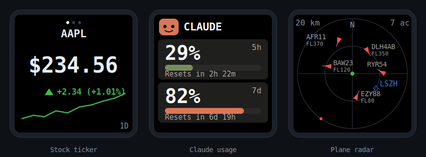
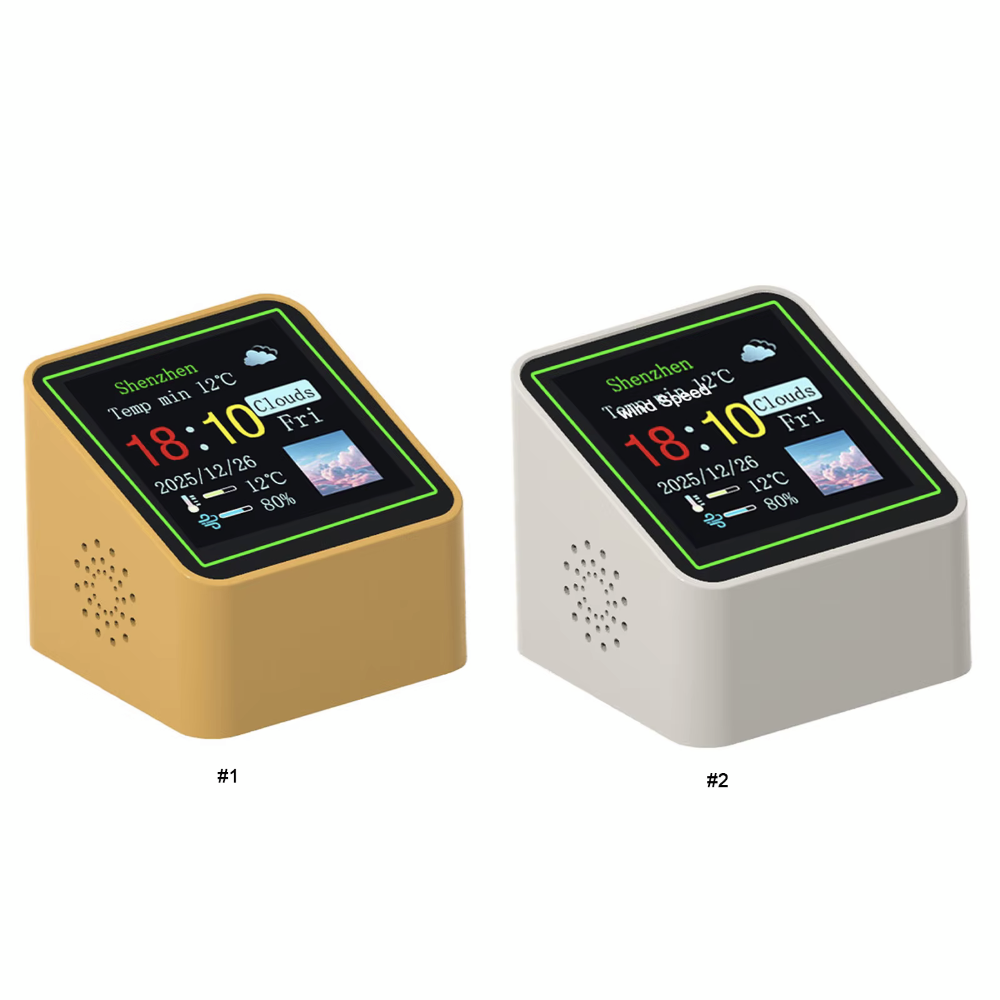

<p align="center">
  
</p>

<h1 align="center">smalltv-mod</h1>

<p align="center">
  <a href="https://github.com/giovi321/smalltv-mod/actions/workflows/build.yml"></a>
  <a href="https://github.com/giovi321/smalltv-mod/actions/workflows/docs.yml"></a>
  <a href="LICENSE"></a>
  
</p>

<p align="center">
  <a href="https://giovi321.github.io/smalltv-mod/"></a>
</p>

> Not affiliated with GeekMagic or Anthropic. This firmware replaces the stock firmware entirely.

The GeekMagic SmallTV is a cheap desk gadget: a little cube with a 1.54" colour screen, an ESP inside, and a USB-C port. This firmware throws away the stock apps and turns it into three things you actually watch. It shows a **stock and crypto ticker** with prices, change, and a sparkline. It flips into a **Claude usage meter** with an animated mascot and your 5-hour and 7-day usage bars. And it becomes a **live plane radar** centred on your location, pulled from a free public feed. One image carries all three; you switch between them in a built-in web UI, and you update over WiFi.

There are two versions of this hardware in the wild, and this firmware builds for both. The original SmallTV runs an ESP8266. A cheaper knockoff sold under the same "smart weather clock" look uses an **ESP32-C2 (ESP8684)** instead. Same screen, different chip, so the firmware ships two build targets from one codebase. Pick yours below.

<p align="center">
  
</p>

## Which one do I have

Check the board before you build, because the two variants flash differently.

| | Original SmallTV | Knockoff |
|---|---|---|
| MCU | ESP-12F (ESP8266), 4 MB flash | ESP32-C2 / ESP8684, 4 MB flash |
| Build env | `smalltv` | `smalltv_c2` |
| Display | 1.54" 240×240 IPS ST7789 | same panel, RGB order |
| Flashing | OTA from the stock web UI, or UART header | USB-C via the onboard CH340C (esptool) |
| Tell-tale | ESP8266 module, no USB-serial chip | CH340C chip next to the USB-C port |

If your board has a **CH340C** chip beside the USB-C port and the main chip reads **ESP8684**, you have the ESP32-C2 knockoff. Full teardown photos and pin maps are in [Hardware and variants](https://giovi321.github.io/smalltv-mod/getting-started/hardware/).

<p align="center">
  
</p>

## What it does

- **Stock and crypto ticker.** Price, absolute change, percent change with an up/down arrow, and a sparkline. Up to 8 symbols rotate on a timer. Data comes straight from Yahoo Finance over HTTPS with no backend, or from your own webhook if you want to own the source. Stocks, ETFs, Swiss equities (`NESN.SW`), crypto (`BTC-USD`), and FX (`EURUSD=X`) all work.
- **Claude usage meter.** An animated pixel mascot plus your 5-hour and 7-day usage as big percentages with fill bars and reset countdowns. It is fed over WiFi by the [clawdmeter-daemon](https://github.com/giovi321/clawdmeter-daemon) on your PC. When the data stops, the mascot plays an idle animation until it comes back.
- **Plane radar.** A scope centred on your location with nearby aircraft as heading triangles, speed vectors, and callsign or altitude labels, from the free [adsb.fi](https://adsb.fi) API or a LAN webhook. Marker size, an altitude filter, and label decluttering are configurable.
- **Web UI for everything.** Join WiFi, pick the mode, manage the symbol list, set brightness, orientation, and colours. First boot creates a `SmallTV-Setup` hotspot with a captive portal.
- **Updates over WiFi.** Upload a firmware image from the browser (both boards), or let the ESP8266 pull the newest release from GitHub itself.

## Get the firmware

You do not need a toolchain. GitHub Actions builds the image for you.

- Every push: the **Actions** tab, latest `build` run, download the firmware artifact.
- Tagged releases (`vX.Y.Z`): attached to the [Releases](../../releases) page.

Or [build it yourself](#building-from-source).

## Flashing

The right method depends on your board. The steps below are the short version; the [Flashing guide](https://giovi321.github.io/smalltv-mod/getting-started/flashing/) covers recovery, backups, and troubleshooting.

**Original SmallTV (ESP8266).** The stock firmware exposes an OTA updater, so you can install this without opening the device. Find its IP, browse to `http://<device-ip>/update`, and upload `smalltv-mod-firmware.bin`. Back up the stock image first if you might want it back.

**Knockoff (ESP32-C2).** Flash over the USB-C cable with esptool, which talks to the onboard CH340C. Auto-reset works, so no button is needed. Back up the stock image first, then write the build:

```bash
# back up the original 4 MB image first
python -m esptool --chip esp32c2 --port COM3 read_flash 0x0 0x400000 stock-backup.bin

# write this firmware (merged image at 0x0)
python -m esptool --chip esp32c2 --port COM3 --baud 921600 write_flash 0x0 firmware.factory.bin
```

After the first flash, both boards update from the browser under the web UI's Update tab.

## First-time setup

1. On first boot the device shows **SETUP MODE** and creates an open `SmallTV-Setup` hotspot.
2. Join it. A captive portal should open; if not, browse to `http://192.168.4.1`.
3. Open **WiFi**, scan, pick your 2.4 GHz network, enter the password, and save. The device reboots and joins.
4. It shows the network and its IP on screen (and `http://smalltv.local`). Browse to it.
5. Add a few tickers under **Symbols** (for example `AAPL`, `NESN.SW`, `BTC-USD`). Yahoo Finance is the default source, so it works immediately.

The [First-time setup guide](https://giovi321.github.io/smalltv-mod/getting-started/setup/) walks through the web UI tab by tab.

## Documentation

Full docs live at **[giovi321.github.io/smalltv-mod](https://giovi321.github.io/smalltv-mod/)**:

- [Hardware and variants](https://giovi321.github.io/smalltv-mod/getting-started/hardware/) with pin maps for both boards
- [Flashing](https://giovi321.github.io/smalltv-mod/getting-started/flashing/) and [first-time setup](https://giovi321.github.io/smalltv-mod/getting-started/setup/)
- The three modes: [ticker](https://giovi321.github.io/smalltv-mod/features/ticker/), [Claude usage](https://giovi321.github.io/smalltv-mod/features/usage/), [plane radar](https://giovi321.github.io/smalltv-mod/features/radar/)
- [Data sources](https://giovi321.github.io/smalltv-mod/reference/data-sources/), [building from source](https://giovi321.github.io/smalltv-mod/reference/building/), and [recovery](https://giovi321.github.io/smalltv-mod/reference/recovery/)

## Building from source

Requires [PlatformIO](https://platformio.org/). Pick the env for your board:

```bash
pio run -e smalltv                 # ESP8266
pio run -e smalltv_c2              # ESP32-C2
pio run -e smalltv_c2 -t upload    # build + flash the C2 over USB-C
pio device monitor -e smalltv_c2   # serial logs @ 115200
```

The two targets share one codebase. Chip differences live in `src/Platform.h` and the per-board pin headers (`src/board_esp8266.h`, `src/board_esp32c2.h`); the three feature modes and the web UI are identical across both. See [Building from source](https://giovi321.github.io/smalltv-mod/reference/building/) for the project layout and the ESP32-C2 toolchain notes.

The PC-side usage daemon lives in its own repo: [clawdmeter-daemon](https://github.com/giovi321/clawdmeter-daemon).

## Credits and references

- GeekMagic SmallTV and SmallTV-Pro, the original product and stock firmware ([GeekMagicClock/smalltv-pro](https://github.com/GeekMagicClock/smalltv-pro)).
- Pin maps and hardware notes from the ESPHome and Tasmota communities:
  - [ViToni/esphome-geekmagic-smalltv](https://github.com/ViToni/esphome-geekmagic-smalltv)
  - [Installing ESPHome on a new smart weather clock (HA community)](https://community.home-assistant.io/t/installing-esphome-on-new-smart-weather-clock-wifi-weather-station-display/1006172), which documented the ESP32-C2 pin map
  - [Puddle of Code, My Own GeekMagic SmallTV](https://puddleofcode.com/story/my-own-geekmagic-smalltv/)
- Claude usage mode reimplements [clawdmeter](https://github.com/HermannBjorgvin/Clawdmeter) for this hardware; the mascot frames come from [claudepix](https://claudepix.vercel.app).
- Libraries: [Arduino_GFX](https://github.com/moononournation/Arduino_GFX), [ArduinoJson](https://arduinojson.org/).

## License

[WTFPL](LICENSE). Do What The F*ck You Want To Public License.
